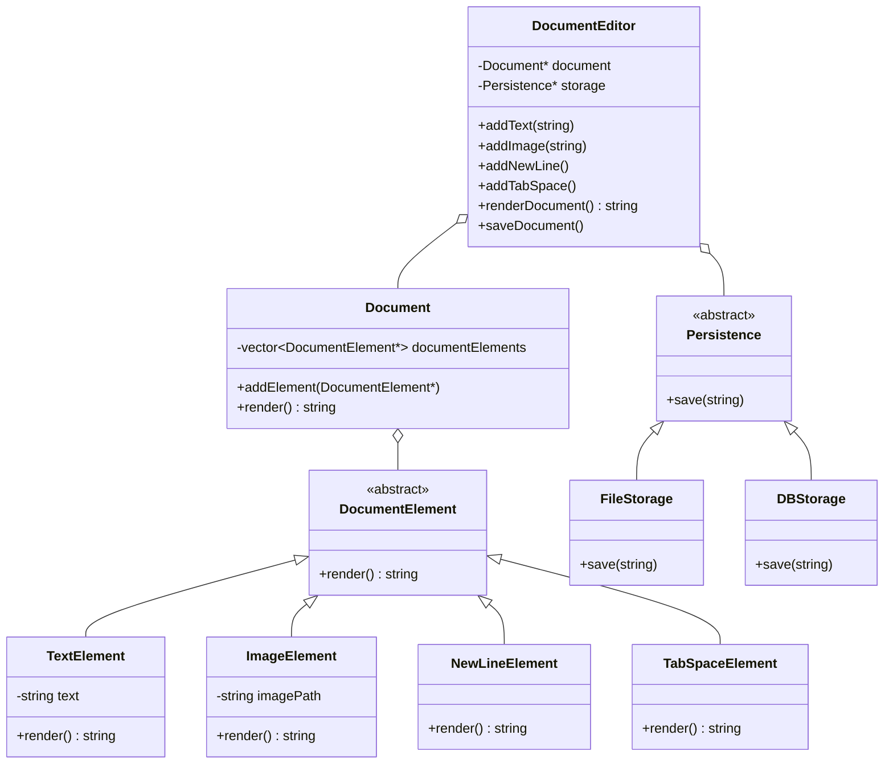

# Document Editor — Low-Level Design (LLD)

A low-level design exercise that models a simple document editor in C++. The goal of this repo is **not** the feature set — it is to demonstrate how a naive, tightly-coupled design can be refactored into a clean, extensible one by applying **SOLID principles** and standard OOP design.

The repository deliberately keeps **two versions** of the same problem so the design reasoning is visible:

| File | Version | Purpose |
|------|---------|---------|
| `DocumentEditor.cpp` | Bad design | The intuitive first attempt — works, but doesn't scale |
| `DocumentEditor (1).cpp` | Good design | Refactored using abstractions and SOLID |

---

## Problem Statement

Build an editor that can:
- Add **text** and **images** to a document
- Support basic formatting elements (new lines, tab spaces)
- **Render** the full document to a string
- **Persist** the rendered document to storage (file, and extensible to a database)

The interesting part is not making it work — it's making it work in a way that's easy to extend with new element types and new storage backends *without modifying existing code*.

---

## Version 1 — The Naive Design (`DocumentEditor.cpp`)

A single `DocumentEditor` class does everything: it stores elements as a flat `vector<string>`, decides at render time whether each string is text or an image, and saves to a file.

```cpp
// element type is inferred from the string contents at runtime
if (element.substr(element.size() - 4) == ".jpg" ||
    element.substr(element.size() - 4) == ".png") {
    result += "[Image: " + element + "]\n";
} else {
    result += element + "\n";
}
```

### Why this is a bad design

- **No separation of concerns** — one class holds element storage, type detection, rendering, *and* persistence. (Violates **SRP**.)
- **Type-by-string-inspection** — an element's type is guessed from its file extension. A text line that happens to end in `.png` breaks. This is fragile and unscalable.
- **Closed to extension** — adding a new element type (e.g. a table, a heading) means editing the `renderDocument()` `if/else` ladder. (Violates **OCP**.)
- **Hard-coded persistence** — saving is welded to a local `.txt` file. No way to swap in a database without rewriting the class.

It works for the demo, and that's exactly the trap — it looks fine until requirements grow.

---

## Version 2 — The Refactored Design (`DocumentEditor (1).cpp`)

The responsibilities are split apart and hidden behind abstractions.

### Key abstractions

**1. `DocumentElement` (abstract base)**
Every element knows how to `render()` itself. Concrete types — `TextElement`, `ImageElement`, `NewLineElement`, `TabSpaceElement` — each implement their own rendering. No more runtime type-guessing.

**2. `Document`**
Holds a collection of `DocumentElement*` and renders by delegating to each element. It doesn't care what the elements *are*.

**3. `Persistence` (abstract base)**
Defines a `save(string)` contract. `FileStorage` writes to disk; `DBStorage` is a placeholder for a database backend. Storage is now a pluggable dependency.

**4. `DocumentEditor`**
The client-facing class. It is *composed* with a `Document` and a `Persistence` implementation (injected via constructor) and exposes a clean API: `addText`, `addImage`, `addNewLine`, `addTabSpace`, `renderDocument`, `saveDocument`.

```cpp
Document* document = new Document();
Persistence* persistence = new FileStorage();   // swap for DBStorage freely
DocumentEditor* editor = new DocumentEditor(document, persistence);
```

---

## SOLID Principles Demonstrated

| Principle | How the refactor applies it |
|-----------|------------------------------|
| **S** — Single Responsibility | Rendering lives in elements, storage in `Persistence`, orchestration in `DocumentEditor`. Each class has one reason to change. |
| **O** — Open/Closed | New element types or storage backends are added by **creating new classes**, not editing existing ones. |
| **L** — Liskov Substitution | Any `DocumentElement` subtype works wherever the base is expected; any `Persistence` can replace another. |
| **D** — Dependency Inversion | `DocumentEditor` depends on the `Persistence` *abstraction*, not on `FileStorage` concretely. The dependency is injected. |

---

## UML Class Diagram



---

## Build & Run

```bash
# Naive version
g++ -std=c++17 DocumentEditor.cpp -o bad_editor && ./bad_editor

# Refactored version
g++ -std=c++17 "DocumentEditor (1).cpp" -o good_editor && ./good_editor
```

Both produce a `document.txt` with the rendered output.

---

## Known Limitations & Roadmap

This is an LLD exercise, and the refactored version is intentionally a starting point. Honest next steps:

- **Resource management** — elements are heap-allocated with `new` and never freed. Move to `std::unique_ptr<DocumentElement>` and add a virtual destructor to `DocumentElement` / `Persistence` (deleting through a base pointer without one is undefined behavior).
- **Render caching** — the cached `renderedDocument` string is not invalidated when new elements are added, so a re-render after edits returns stale output. Invalidate on mutation, or drop the cache.
- **Undo / Redo** — introduce the **Command pattern** so each edit is a reversible operation. This is the natural next feature for a real editor.
- **Nested structure** — apply the **Composite pattern** so a document can contain sections/containers, not just a flat list of elements.

---

## What This Project Shows

The point isn't a working editor — it's the **before/after**: recognizing the smells in the naive design (rigid type checks, mixed responsibilities, hard-coded dependencies) and resolving them with abstraction and dependency injection. The roadmap above reflects the same mindset applied one step further.
